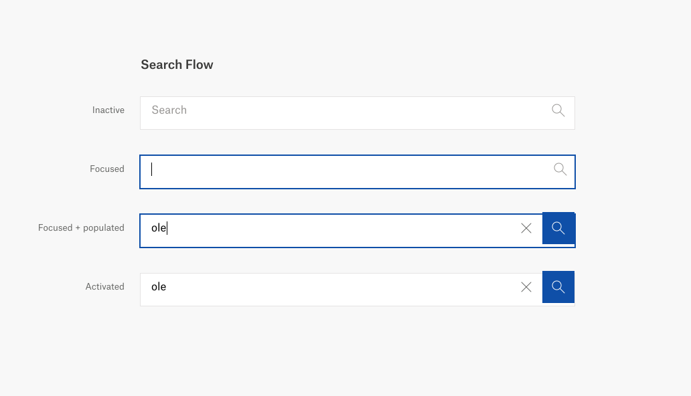
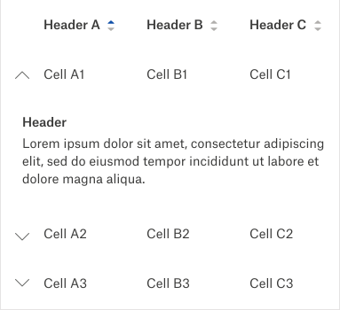

# Exercise 1 - User interface

Build an user interface that matches the design below.
Icons are located in the `src/assets/` folder.



**TIP** Responsive layout and accessibility

# Exercise 2 - State management

Extend the user interface you created in the previous exercise to manage state.

Implement state management for the search and add the magnifying glass with a button to clear the form input

# Exercise 3 - Search

For this exercise we have created a backend API that returns a list of Hurtigruten's ships. When the server is running (`npm run server`) you can query the `/api/ships` endpoint. If you want to find ships with a name that contains, for example `amundsen`, you can provide the search query as an path parameter:

```
curl -s http://localhost:4000/api/ships/amundsen
```

Extend your application to perform a search when the user presses enter.

List the result in a table as seen below. Each ship has a lot of data, you don't need to show them all, just pick a few property. **Only implement the sorting when you have the time!**

When done add an accordion to the rows (as on the image) to display `body` from the JSON, and limit the text.



**TIP** There is something missing from the server...

# Exercise 4 - Search as you type

Pressing the magnifying glass to perform a search is exhausting.

Implement functionality to search as you type (keep the key binding as well)

# Exercise 5 - Performance

Performing a search for each character change might be an overkill with a big dataset like the ships. Consider implementing some performance optimization.
